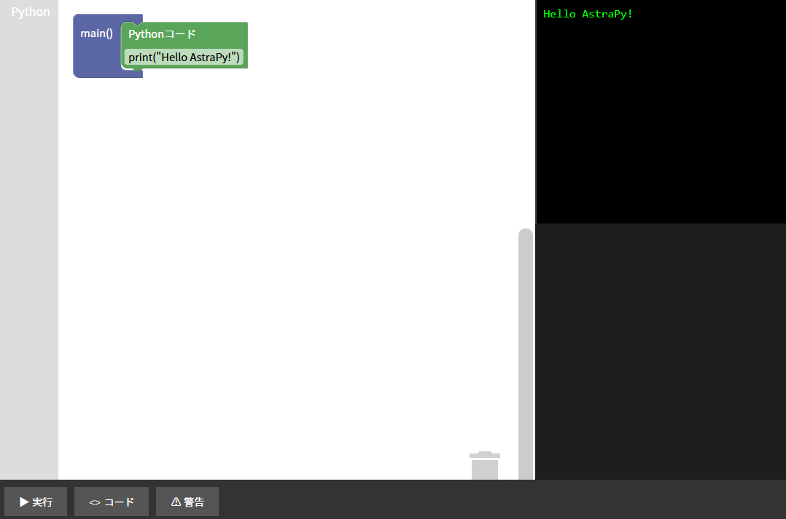

# AstraPy  
The First Star of NexFlow

AstraPy は、Python をブロックで動かすための  
**Web ネイティブ・ブロック × Python IDE** です。

ブラウザだけで動作し、教育・創作・実験のすべてを  
ひとつの宇宙に統合することを目指しています。

---

## ✨ Features

- **ブロック × Python のハイブリッド IDE**  
  直感的なブロック操作と、実用的な Python コードを同時に扱える環境。

- **完全 Web ネイティブ**  
  インストール不要。ブラウザを開くだけで即スタート。

- **OSS として拡張可能**  
  ブロック追加、テーマ変更、機能拡張など自由自在。

- **教育にも創作にも最適**  
  初学者からクリエイターまで、誰でも使える設計。

---

## 🚀 Demo

AstraPy IDE を今すぐ試す：

👉 **https://akito5928.github.io/AstraPy/**

---

## 🖼 Screenshot

（ここにスクショを貼る）

```md


---

# 📚 使用しているオープンソースライブラリ（あなたの内容を統合）

```md
## 📚 使用しているオープンソースライブラリ

AstraPy は以下の OSS を利用しています。

- **Blockly** (Apache License 2.0)  
  https://developers.google.com/blockly

- **Blockly Python Generator** (Apache License 2.0)  
  https://developers.google.com/blockly

- **Pyodide** (Mozilla Public License 2.0)  
  https://pyodide.org/

各ライブラリのライセンス全文は `LICENSES/` フォルダにまとめています。

---

## 🛣 Roadmap

- ブロックカテゴリの拡張  
- 3D / Unity 連携  
- AI ブロックの追加  
- NexFlow 全体との統合  
- プロジェクト共有ギャラリー  

---

## 📜 License

AstraPy は **MIT License** のもとで公開されています。

---

## 🤝 Contributing

AstraPy はオープンなプロジェクトです。  
Issue / Pull Request はいつでも歓迎します。